# Car Rental System - Database Design

## 1. Database Architecture Overview

### 1.1 Design Principles
- **Microservices Database Pattern**: Each service maintains its own database
- **Eventual Consistency**: Data consistency across services through events
- **Scalability**: Designed for horizontal scaling and high performance
- **Security**: Encryption at rest and in transit, PCI DSS compliance
- **Audit Trail**: Complete audit logging for all data changes

### 1.2 Database Technologies
- **Primary Database**: PostgreSQL for transactional data
- **Cache Layer**: Redis for session management and caching
- **Search Engine**: Elasticsearch for full-text search and analytics
- **Data Warehouse**: ClickHouse for analytical queries and reporting

## 2. Entity Relationship Diagram

```mermaid
erDiagram
    %% User Management Entities
    USERS {
        uuid user_id PK
        string email UK
        string password_hash
        string first_name
        string last_name
        string phone
        date date_of_birth
        string driving_license
        string status
        jsonb address
        jsonb preferences
        timestamp created_at
        timestamp updated_at
        timestamp last_login_at
    }
    
    USER_ROLES {
        uuid role_id PK
        string role_name UK
        string description
        jsonb permissions
        timestamp created_at
        timestamp updated_at
    }
    
    USER_ROLE_ASSIGNMENTS {
        uuid assignment_id PK
        uuid user_id FK
        uuid role_id FK
        timestamp assigned_at
        timestamp expires_at
        boolean is_active
    }
    
    USER_SESSIONS {
        uuid session_id PK
        uuid user_id FK
        string access_token
        string refresh_token
        timestamp expires_at
        string ip_address
        string user_agent
        timestamp created_at
        timestamp last_accessed_at
    }
    
    %% Vehicle Management Entities
    VEHICLES {
        uuid vehicle_id PK
        string vin UK
        string license_plate UK
        string make
        string model
        integer year
        string category
        string transmission
        string fuel_type
        decimal engine_size
        integer seats
        integer doors
        integer luggage_capacity
        jsonb features
        jsonb images
        uuid current_location_id FK
        string status
        decimal odometer_reading
        timestamp last_maintenance_date
        timestamp created_at
        timestamp updated_at
    }
    
    VEHICLE_CATEGORIES {
        uuid category_id PK
        string category_name UK
        string description
        decimal base_daily_rate
        jsonb specifications
        timestamp created_at
        timestamp updated_at
    }
    
    VEHICLE_FEATURES {
        uuid feature_id PK
        string feature_name UK
        string display_name
        string description
        string feature_type
        boolean is_standard
        decimal additional_cost
        timestamp created_at
        timestamp updated_at
    }
    
    VEHICLE_LOCATIONS {
        uuid location_id PK
        string location_name
        string address
        decimal latitude
        decimal longitude
        string location_type
        jsonb amenities
        boolean is_active
        timestamp created_at
        timestamp updated_at
    }
    
    VEHICLE_MAINTENANCE {
        uuid maintenance_id PK
        uuid vehicle_id FK
        string maintenance_type
        string description
        decimal cost
        timestamp scheduled_date
        timestamp completed_date
        string status
        uuid service_provider_id FK
        jsonb maintenance_details
        timestamp created_at
        timestamp updated_at
    }
    
    %% Booking Management Entities
    BOOKINGS {
        uuid booking_id PK
        uuid user_id FK
        uuid vehicle_id FK
        uuid pickup_location_id FK
        uuid return_location_id FK
        timestamp pickup_datetime
        timestamp return_datetime
        string status
        decimal total_amount
        decimal paid_amount
        string currency
        string confirmation_number UK
        jsonb driver_info
        jsonb additional_drivers
        jsonb special_requests
        timestamp created_at
        timestamp updated_at
        timestamp cancelled_at
    }
    
    BOOKING_STATUS_HISTORY {
        uuid history_id PK
        uuid booking_id FK
        string status
        string notes
        uuid changed_by FK
        timestamp changed_at
    }
    
    BOOKING_EXTRAS {
        uuid booking_extra_id PK
        uuid booking_id FK
        uuid extra_id FK
        decimal price
        integer quantity
        timestamp created_at
    }
    
    EXTRAS {
        uuid extra_id PK
        string extra_name UK
        string display_name
        string description
        decimal base_price
        string pricing_type
        boolean is_available
        timestamp created_at
        timestamp updated_at
    }
    
    %% Payment Management Entities
    PAYMENTS {
        uuid payment_id PK
        uuid booking_id FK
        uuid user_id FK
        string payment_method
        decimal amount
        string currency
        string status
        string transaction_id
        string gateway_response
        timestamp processed_at
        timestamp created_at
        timestamp updated_at
    }
    
    PAYMENT_METHODS {
        uuid method_id PK
        uuid user_id FK
        string method_type
        string brand
        string last_four_digits
        integer expiry_month
        integer expiry_year
        string holder_name
        jsonb billing_address
        boolean is_default
        string status
        timestamp created_at
        timestamp updated_at
    }
    
    REFUNDS {
        uuid refund_id PK
        uuid payment_id FK
        uuid booking_id FK
        decimal amount
        string reason
        string status
        string transaction_id
        timestamp processed_at
        timestamp created_at
        timestamp updated_at
    }
    
    %% Insurance Management Entities
    INSURANCE_POLICIES {
        uuid policy_id PK
        string policy_name UK
        string description
        decimal coverage_amount
        decimal deductible
        decimal daily_rate
        boolean is_standard
        jsonb coverage_details
        timestamp created_at
        timestamp updated_at
    }
    
    BOOKING_INSURANCE {
        uuid booking_insurance_id PK
        uuid booking_id FK
        uuid policy_id FK
        decimal premium_amount
        timestamp created_at
    }
    
    %% Pricing and Promotions Entities
    PRICING_RULES {
        uuid rule_id PK
        string rule_name
        string rule_type
        jsonb conditions
        decimal adjustment_amount
        string adjustment_type
        timestamp valid_from
        timestamp valid_until
        boolean is_active
        timestamp created_at
        timestamp updated_at
    }
    
    PROMOTIONS {
        uuid promotion_id PK
        string promotion_code UK
        string promotion_name
        string description
        string promotion_type
        decimal discount_amount
        string discount_type
        integer usage_limit
        integer usage_count
        timestamp valid_from
        timestamp valid_until
        boolean is_active
        timestamp created_at
        timestamp updated_at
    }
    
    PROMOTION_USAGE {
        uuid usage_id PK
        uuid promotion_id FK
        uuid booking_id FK
        uuid user_id FK
        decimal discount_applied
        timestamp used_at
    }
    
    %% Notification Management Entities
    NOTIFICATIONS {
        uuid notification_id PK
        uuid user_id FK
        string notification_type
        string title
        string message
        jsonb metadata
        string status
        timestamp sent_at
        timestamp read_at
        timestamp created_at
    }
    
    NOTIFICATION_TEMPLATES {
        uuid template_id PK
        string template_name UK
        string notification_type
        string subject_template
        string body_template
        jsonb variables
        boolean is_active
        timestamp created_at
        timestamp updated_at
    }
    
    %% Audit and Logging Entities
    AUDIT_LOGS {
        uuid log_id PK
        uuid user_id FK
        string entity_type
        uuid entity_id
        string action
        jsonb old_values
        jsonb new_values
        string ip_address
        string user_agent
        timestamp created_at
    }
    
    SYSTEM_LOGS {
        uuid log_id PK
        string log_level
        string service_name
        string message
        jsonb context
        string trace_id
        timestamp created_at
    }
    
    %% Relationships
    USERS ||--o{ USER_ROLE_ASSIGNMENTS : "has"
    USER_ROLES ||--o{ USER_ROLE_ASSIGNMENTS : "assigned to"
    USERS ||--o{ USER_SESSIONS : "creates"
    USERS ||--o{ BOOKINGS : "makes"
    USERS ||--o{ PAYMENT_METHODS : "owns"
    USERS ||--o{ PAYMENTS : "makes"
    USERS ||--o{ NOTIFICATIONS : "receives"
    
    VEHICLES ||--o{ BOOKINGS : "rented in"
    VEHICLES ||--o{ VEHICLE_MAINTENANCE : "requires"
    VEHICLES }o--|| VEHICLE_LOCATIONS : "located at"
    VEHICLE_CATEGORIES ||--o{ VEHICLES : "categorizes"
    
    BOOKINGS ||--o{ BOOKING_STATUS_HISTORY : "has history"
    BOOKINGS ||--o{ BOOKING_EXTRAS : "includes"
    BOOKINGS ||--o{ BOOKING_INSURANCE : "covers"
    BOOKINGS ||--o{ PAYMENTS : "paid by"
    BOOKINGS ||--o{ REFUNDS : "refunded for"
    BOOKINGS }o--|| VEHICLE_LOCATIONS : "picked up from"
    BOOKINGS }o--|| VEHICLE_LOCATIONS : "returned to"
    
    EXTRAS ||--o{ BOOKING_EXTRAS : "included in"
    INSURANCE_POLICIES ||--o{ BOOKING_INSURANCE : "covers"
    PAYMENTS ||--o{ REFUNDS : "refunded"
    
    PROMOTIONS ||--o{ PROMOTION_USAGE : "used in"
    BOOKINGS ||--o{ PROMOTION_USAGE : "uses"
```



## 3. Database Schema Details

### 3.1 User Management Schema

#### Users Table
```sql
CREATE TABLE users (
    user_id UUID PRIMARY KEY DEFAULT gen_random_uuid(),
    email VARCHAR(255) UNIQUE NOT NULL,
    password_hash VARCHAR(255) NOT NULL,
    first_name VARCHAR(100) NOT NULL,
    last_name VARCHAR(100) NOT NULL,
    phone VARCHAR(20),
    date_of_birth DATE,
    driving_license VARCHAR(50),
    status VARCHAR(20) DEFAULT 'pending_verification',
    address JSONB,
    preferences JSONB,
    created_at TIMESTAMP WITH TIME ZONE DEFAULT CURRENT_TIMESTAMP,
    updated_at TIMESTAMP WITH TIME ZONE DEFAULT CURRENT_TIMESTAMP,
    last_login_at TIMESTAMP WITH TIME ZONE
);

-- Indexes
CREATE INDEX idx_users_email ON users(email);
CREATE INDEX idx_users_status ON users(status);
CREATE INDEX idx_users_created_at ON users(created_at);
```

#### User Roles Table
```sql
CREATE TABLE user_roles (
    role_id UUID PRIMARY KEY DEFAULT gen_random_uuid(),
    role_name VARCHAR(50) UNIQUE NOT NULL,
    description TEXT,
    permissions JSONB NOT NULL,
    created_at TIMESTAMP WITH TIME ZONE DEFAULT CURRENT_TIMESTAMP,
    updated_at TIMESTAMP WITH TIME ZONE DEFAULT CURRENT_TIMESTAMP
);

-- Insert default roles
INSERT INTO user_roles (role_name, description, permissions) VALUES
('customer', 'Regular customer', '{"bookings": ["create", "read", "update", "cancel"], "profile": ["read", "update"]}'),
('fleet_manager', 'Fleet management staff', '{"vehicles": ["create", "read", "update", "delete"], "maintenance": ["create", "read", "update"]}'),
('admin', 'System administrator', '{"all": ["create", "read", "update", "delete"]}');
```

### 3.2 Vehicle Management Schema

#### Vehicles Table
```sql
CREATE TABLE vehicles (
    vehicle_id UUID PRIMARY KEY DEFAULT gen_random_uuid(),
    vin VARCHAR(17) UNIQUE NOT NULL,
    license_plate VARCHAR(20) UNIQUE NOT NULL,
    make VARCHAR(50) NOT NULL,
    model VARCHAR(50) NOT NULL,
    year INTEGER NOT NULL,
    category VARCHAR(50) NOT NULL,
    transmission VARCHAR(20) NOT NULL,
    fuel_type VARCHAR(20) NOT NULL,
    engine_size DECIMAL(3,1),
    seats INTEGER NOT NULL,
    doors INTEGER NOT NULL,
    luggage_capacity INTEGER,
    features JSONB,
    images JSONB,
    current_location_id UUID REFERENCES vehicle_locations(location_id),
    status VARCHAR(20) DEFAULT 'available',
    odometer_reading DECIMAL(10,2) DEFAULT 0,
    last_maintenance_date DATE,
    created_at TIMESTAMP WITH TIME ZONE DEFAULT CURRENT_TIMESTAMP,
    updated_at TIMESTAMP WITH TIME ZONE DEFAULT CURRENT_TIMESTAMP
);

-- Indexes
CREATE INDEX idx_vehicles_category ON vehicles(category);
CREATE INDEX idx_vehicles_status ON vehicles(status);
CREATE INDEX idx_vehicles_location ON vehicles(current_location_id);
CREATE INDEX idx_vehicles_make_model ON vehicles(make, model);
```

#### Vehicle Categories Table
```sql
CREATE TABLE vehicle_categories (
    category_id UUID PRIMARY KEY DEFAULT gen_random_uuid(),
    category_name VARCHAR(50) UNIQUE NOT NULL,
    description TEXT,
    base_daily_rate DECIMAL(10,2) NOT NULL,
    specifications JSONB,
    created_at TIMESTAMP WITH TIME ZONE DEFAULT CURRENT_TIMESTAMP,
    updated_at TIMESTAMP WITH TIME ZONE DEFAULT CURRENT_TIMESTAMP
);

-- Insert default categories
INSERT INTO vehicle_categories (category_name, description, base_daily_rate, specifications) VALUES
('economy', 'Small, fuel-efficient vehicles', 45.99, '{"seats": 4, "doors": 4, "luggage": 2}'),
('compact', 'Mid-size sedans with good fuel economy', 59.99, '{"seats": 5, "doors": 4, "luggage": 3}'),
('midsize', 'Comfortable sedans with ample space', 79.99, '{"seats": 5, "doors": 4, "luggage": 4}'),
('fullsize', 'Large sedans with premium features', 99.99, '{"seats": 5, "doors": 4, "luggage": 5}'),
('luxury', 'Premium vehicles with luxury features', 149.99, '{"seats": 5, "doors": 4, "luggage": 4}'),
('suv', 'Sport Utility Vehicles', 119.99, '{"seats": 7, "doors": 5, "luggage": 6}'),
('van', 'Large passenger vans', 129.99, '{"seats": 8, "doors": 5, "luggage": 8}');
```

### 3.3 Booking Management Schema

#### Bookings Table
```sql
CREATE TABLE bookings (
    booking_id UUID PRIMARY KEY DEFAULT gen_random_uuid(),
    user_id UUID NOT NULL REFERENCES users(user_id),
    vehicle_id UUID NOT NULL REFERENCES vehicles(vehicle_id),
    pickup_location_id UUID NOT NULL REFERENCES vehicle_locations(location_id),
    return_location_id UUID NOT NULL REFERENCES vehicle_locations(location_id),
    pickup_datetime TIMESTAMP WITH TIME ZONE NOT NULL,
    return_datetime TIMESTAMP WITH TIME ZONE NOT NULL,
    status VARCHAR(20) DEFAULT 'pending',
    total_amount DECIMAL(10,2) NOT NULL,
    paid_amount DECIMAL(10,2) DEFAULT 0,
    currency VARCHAR(3) DEFAULT 'USD',
    confirmation_number VARCHAR(20) UNIQUE NOT NULL,
    driver_info JSONB NOT NULL,
    additional_drivers JSONB,
    special_requests TEXT,
    created_at TIMESTAMP WITH TIME ZONE DEFAULT CURRENT_TIMESTAMP,
    updated_at TIMESTAMP WITH TIME ZONE DEFAULT CURRENT_TIMESTAMP,
    cancelled_at TIMESTAMP WITH TIME ZONE
);

-- Indexes
CREATE INDEX idx_bookings_user_id ON bookings(user_id);
CREATE INDEX idx_bookings_vehicle_id ON bookings(vehicle_id);
CREATE INDEX idx_bookings_status ON bookings(status);
CREATE INDEX idx_bookings_pickup_datetime ON bookings(pickup_datetime);
CREATE INDEX idx_bookings_return_datetime ON bookings(return_datetime);
CREATE INDEX idx_bookings_confirmation_number ON bookings(confirmation_number);
```

### 3.4 Payment Management Schema

#### Payments Table
```sql
CREATE TABLE payments (
    payment_id UUID PRIMARY KEY DEFAULT gen_random_uuid(),
    booking_id UUID NOT NULL REFERENCES bookings(booking_id),
    user_id UUID NOT NULL REFERENCES users(user_id),
    payment_method VARCHAR(50) NOT NULL,
    amount DECIMAL(10,2) NOT NULL,
    currency VARCHAR(3) DEFAULT 'USD',
    status VARCHAR(20) NOT NULL,
    transaction_id VARCHAR(100),
    gateway_response JSONB,
    processed_at TIMESTAMP WITH TIME ZONE,
    created_at TIMESTAMP WITH TIME ZONE DEFAULT CURRENT_TIMESTAMP,
    updated_at TIMESTAMP WITH TIME ZONE DEFAULT CURRENT_TIMESTAMP
);

-- Indexes
CREATE INDEX idx_payments_booking_id ON payments(booking_id);
CREATE INDEX idx_payments_user_id ON payments(user_id);
CREATE INDEX idx_payments_status ON payments(status);
CREATE INDEX idx_payments_transaction_id ON payments(transaction_id);
```

## 4. Data Access Patterns

### 4.1 Read Patterns

#### High-Frequency Queries
```sql
-- Search available vehicles
SELECT v.*, vl.address, vl.latitude, vl.longitude
FROM vehicles v
JOIN vehicle_locations vl ON v.current_location_id = vl.location_id
WHERE v.status = 'available'
  AND v.category = $1
  AND ST_DWithin(
    ST_Point(vl.longitude, vl.latitude),
    ST_Point($2, $3),
    50000  -- 50km radius
  )
  AND NOT EXISTS (
    SELECT 1 FROM bookings b
    WHERE b.vehicle_id = v.vehicle_id
      AND b.status IN ('confirmed', 'active')
      AND (b.pickup_datetime, b.return_datetime) OVERLAPS ($4, $5)
  );

-- Get user booking history
SELECT b.*, v.make, v.model, v.year, vl1.address as pickup_address, vl2.address as return_address
FROM bookings b
JOIN vehicles v ON b.vehicle_id = v.vehicle_id
JOIN vehicle_locations vl1 ON b.pickup_location_id = vl1.location_id
JOIN vehicle_locations vl2 ON b.return_location_id = vl2.location_id
WHERE b.user_id = $1
ORDER BY b.created_at DESC
LIMIT $2 OFFSET $3;
```

### 4.2 Write Patterns

#### Booking Creation Transaction
```sql
BEGIN;

-- Create booking
INSERT INTO bookings (user_id, vehicle_id, pickup_location_id, return_location_id, 
                     pickup_datetime, return_datetime, total_amount, confirmation_number, driver_info)
VALUES ($1, $2, $3, $4, $5, $6, $7, $8, $9);

-- Update vehicle status
UPDATE vehicles SET status = 'reserved' WHERE vehicle_id = $2;

-- Create payment record
INSERT INTO payments (booking_id, user_id, payment_method, amount, status, transaction_id)
VALUES (currval('bookings_booking_id_seq'), $1, $10, $7, 'pending', $11);

COMMIT;
```

## 5. Data Migration Strategy

### 5.1 Migration Approach
- **Zero-Downtime Migrations**: Using blue-green deployment
- **Backward Compatibility**: Maintain API compatibility during transitions
- **Data Validation**: Comprehensive validation before and after migration
- **Rollback Plan**: Ability to rollback migrations if issues arise

### 5.2 Migration Scripts Example
```sql
-- Migration: Add loyalty points to users table
-- Version: 2024.01.001

-- Add new column
ALTER TABLE users ADD COLUMN loyalty_points INTEGER DEFAULT 0;

-- Add index for performance
CREATE INDEX idx_users_loyalty_points ON users(loyalty_points);

-- Update existing users with calculated loyalty points
UPDATE users 
SET loyalty_points = (
    SELECT COALESCE(SUM(
        CASE 
            WHEN b.status = 'completed' THEN 100
            WHEN b.status = 'cancelled' THEN 0
            ELSE 0
        END
    ), 0)
    FROM bookings b
    WHERE b.user_id = users.user_id
);

-- Add constraint
ALTER TABLE users ADD CONSTRAINT chk_loyalty_points_positive 
CHECK (loyalty_points >= 0);
```

## 6. Performance Optimization

### 6.1 Indexing Strategy
- **Primary Indexes**: On primary keys and foreign keys
- **Composite Indexes**: For multi-column queries
- **Partial Indexes**: For filtered queries
- **Covering Indexes**: To avoid table lookups

### 6.2 Query Optimization
- **Query Analysis**: Regular analysis of slow queries
- **Query Rewriting**: Optimize complex queries
- **Connection Pooling**: Efficient database connections
- **Read Replicas**: Distribute read load

### 6.3 Caching Strategy
- **Application Cache**: Redis for frequently accessed data
- **Query Result Cache**: Cache expensive query results
- **Session Cache**: User session data
- **CDN Cache**: Static content and images

## 7. Backup and Recovery

### 7.1 Backup Strategy
- **Full Backups**: Daily full database backups
- **Incremental Backups**: Hourly incremental backups
- **Point-in-Time Recovery**: Continuous WAL archiving
- **Cross-Region Backups**: Geographic redundancy

### 7.2 Recovery Procedures
- **RTO (Recovery Time Objective)**: 4 hours
- **RPO (Recovery Point Objective)**: 1 hour
- **Automated Recovery**: Automated failover procedures
- **Testing**: Regular disaster recovery testing

## 8. Security Considerations

### 8.1 Data Encryption
- **Encryption at Rest**: Database-level encryption
- **Encryption in Transit**: TLS for all connections
- **Field-Level Encryption**: Sensitive data encryption
- **Key Management**: Secure key rotation

### 8.2 Access Control
- **Role-Based Access**: Database user roles
- **Network Security**: VPC and firewall rules
- **Audit Logging**: Complete audit trail
- **Data Masking**: Sensitive data protection

---

*Document Version: 1.0*  
*Last Updated: [Current Date]*  
*Next Review: [Date + 3 months]*
