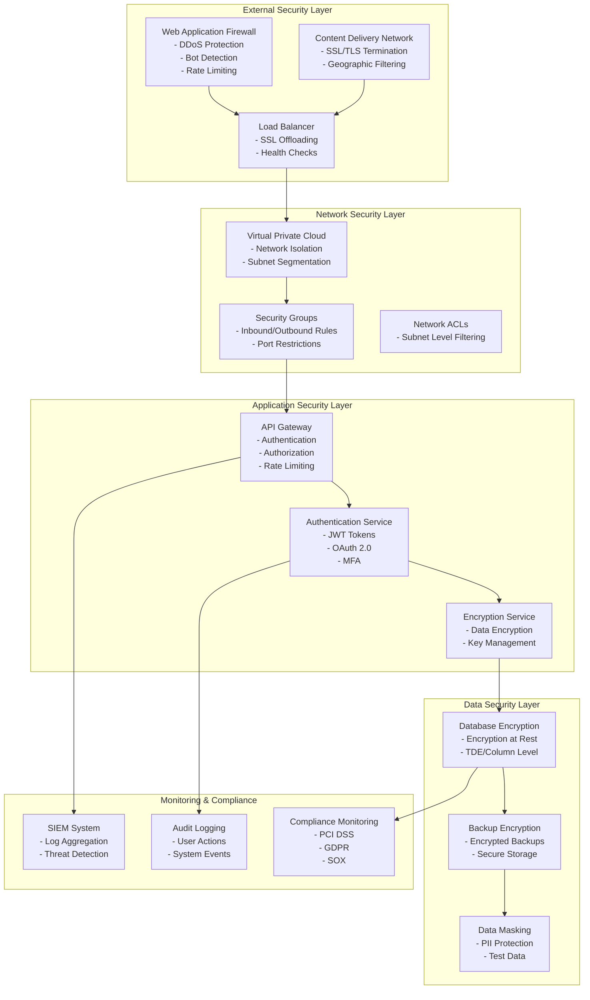
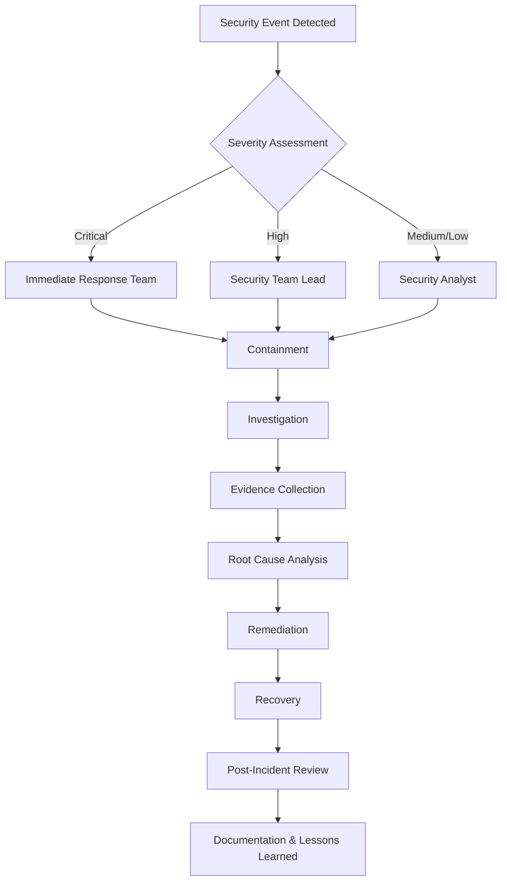

# Car Rental System - Security & Compliance

## 1. Security Framework Overview

### 1.1 Security Principles
- **Defense in Depth**: Multiple layers of security controls
- **Least Privilege**: Minimal necessary access permissions
- **Zero Trust**: Verify every request and transaction
- **Security by Design**: Security integrated from the beginning
- **Continuous Monitoring**: Real-time security monitoring and alerting

### 1.2 Security Architecture



## 2. Authentication & Authorization

### 2.1 Authentication Framework

#### Multi-Factor Authentication (MFA)
```json
{
  "authentication_methods": [
    {
      "primary": "password",
      "secondary": ["sms", "email", "totp", "biometric"],
      "fallback": "recovery_codes"
    }
  ],
  "mfa_requirements": {
    "admin_users": "mandatory",
    "fleet_managers": "mandatory", 
    "customers": "optional"
  },
  "session_management": {
    "access_token_ttl": "15_minutes",
    "refresh_token_ttl": "7_days",
    "max_concurrent_sessions": 3
  }
}
```

#### OAuth 2.0 Implementation
```yaml
oauth2_flows:
  authorization_code:
    client_types: ["web_app", "mobile_app"]
    redirect_uris: ["https://app.carrental.com/callback"]
    scopes: ["read", "write", "admin"]
  
  client_credentials:
    client_types: ["service_accounts"]
    scopes: ["internal_api"]
  
  refresh_token:
    rotation_enabled: true
    reuse_detection: true
```

### 2.2 Role-Based Access Control (RBAC)

#### Role Definitions
```sql
-- Role hierarchy and permissions
CREATE TABLE security_roles (
    role_id UUID PRIMARY KEY,
    role_name VARCHAR(50) UNIQUE NOT NULL,
    role_level INTEGER NOT NULL,
    permissions JSONB NOT NULL,
    inherits_from UUID REFERENCES security_roles(role_id)
);

-- Permission structure
{
  "resources": {
    "users": ["create", "read", "update", "delete"],
    "vehicles": ["create", "read", "update", "delete"],
    "bookings": ["create", "read", "update", "cancel"],
    "payments": ["read", "process", "refund"],
    "reports": ["read", "export"]
  },
  "conditions": {
    "own_data_only": true,
    "department_scope": "fleet_management"
  }
}
```

#### Access Control Matrix
| Role | Users | Vehicles | Bookings | Payments | Reports | Admin |
|------|-------|----------|----------|----------|---------|-------|
| Customer | Own | Read | Own | Own | None | None |
| Fleet Manager | Read | Full | Read | Read | Fleet | None |
| Finance | Read | Read | Read | Full | Financial | None |
| Admin | Full | Full | Full | Full | Full | Full |

## 3. Data Protection & Privacy

### 3.1 Data Classification

#### Data Sensitivity Levels
```yaml
data_classification:
  public:
    description: "Publicly available information"
    examples: ["vehicle specifications", "pricing", "locations"]
    encryption: "none"
    
  internal:
    description: "Internal business information"
    examples: ["operational data", "analytics", "reports"]
    encryption: "at_rest"
    
  confidential:
    description: "Sensitive business information"
    examples: ["financial data", "business strategies"]
    encryption: "at_rest_and_in_transit"
    
  restricted:
    description: "Highly sensitive personal data"
    examples: ["payment information", "driving records", "biometric data"]
    encryption: "end_to_end"
    access_controls: "strict"
```

### 3.2 Encryption Implementation

#### Encryption at Rest
```yaml
encryption_at_rest:
  database:
    method: "AES-256-GCM"
    key_management: "AWS KMS / Azure Key Vault"
    key_rotation: "90_days"
    
  file_storage:
    method: "AES-256-CBC"
    key_management: "Cloud Provider KMS"
    
  backups:
    method: "AES-256-GCM"
    key_management: "Separate KMS instance"
```

#### Encryption in Transit
```yaml
encryption_in_transit:
  api_communications:
    protocol: "TLS 1.3"
    cipher_suites: ["TLS_AES_256_GCM_SHA384", "TLS_CHACHA20_POLY1305_SHA256"]
    certificate_management: "Let's Encrypt / ACM"
    
  database_connections:
    protocol: "TLS 1.3"
    certificate_validation: "strict"
    
  internal_services:
    protocol: "mTLS"
    certificate_rotation: "30_days"
```

### 3.3 Data Masking & Anonymization

#### PII Data Masking
```sql
-- Data masking functions
CREATE OR REPLACE FUNCTION mask_email(email TEXT)
RETURNS TEXT AS $$
BEGIN
  RETURN regexp_replace(email, '^(.{2}).*(@.*)$', '\1***\2');
END;
$$ LANGUAGE plpgsql;

CREATE OR REPLACE FUNCTION mask_phone(phone TEXT)
RETURNS TEXT AS $$
BEGIN
  RETURN regexp_replace(phone, '^(\+?\d{1,3})\d{3}(\d{4})$', '\1***\2');
END;
$$ LANGUAGE plpgsql;

-- Usage in queries
SELECT 
  user_id,
  mask_email(email) as email,
  mask_phone(phone) as phone,
  first_name,
  last_name
FROM users;
```

## 4. Payment Security (PCI DSS Compliance)

### 4.1 PCI DSS Requirements

#### PCI DSS Level 1 Compliance
```yaml
pci_dss_requirements:
  requirement_1:
    title: "Install and maintain a firewall configuration"
    implementation:
      - "Network segmentation for payment systems"
      - "Firewall rules for cardholder data environment"
      - "Regular firewall rule reviews"
      
  requirement_2:
    title: "Do not use vendor-supplied defaults"
    implementation:
      - "Change default passwords and settings"
      - "Disable unnecessary services"
      - "Secure configuration baselines"
      
  requirement_3:
    title: "Protect stored cardholder data"
    implementation:
      - "Encryption of stored card data"
      - "Tokenization for payment processing"
      - "Data retention policies"
      
  requirement_4:
    title: "Encrypt transmission of cardholder data"
    implementation:
      - "TLS 1.3 for all transmissions"
      - "Certificate management"
      - "Secure key exchange"
```

### 4.2 Payment Tokenization

#### Tokenization Implementation
```javascript
// Payment tokenization service
class PaymentTokenizationService {
  async tokenizeCard(cardData) {
    // Send to PCI-compliant tokenization service
    const tokenResponse = await this.tokenizationProvider.createToken({
      card_number: cardData.number,
      expiry_month: cardData.expiryMonth,
      expiry_year: cardData.expiryYear,
      cvv: cardData.cvv,
      holder_name: cardData.holderName
    });
    
    // Store only token, never store actual card data
    return {
      token: tokenResponse.token,
      last_four: tokenResponse.last_four,
      brand: tokenResponse.brand,
      expiry_month: tokenResponse.expiry_month,
      expiry_year: tokenResponse.expiry_year
    };
  }
  
  async detokenizeForPayment(token, amount) {
    // Process payment using token
    return await this.paymentProcessor.charge({
      token: token,
      amount: amount,
      currency: 'USD'
    });
  }
}
```

## 5. GDPR Compliance

### 5.1 Data Subject Rights

#### Right to Access (Article 15)
```json
{
  "data_subject_request": {
    "type": "access_request",
    "user_id": "user_123456",
    "requested_data": [
      "personal_information",
      "booking_history", 
      "payment_records",
      "communication_logs",
      "preferences"
    ],
    "response_format": "json",
    "delivery_method": "secure_download"
  }
}
```

#### Right to Erasure (Article 17)
```sql
-- Data erasure procedure
CREATE OR REPLACE FUNCTION process_data_erasure(user_id UUID)
RETURNS BOOLEAN AS $$
DECLARE
  retention_period INTERVAL := '7 years';
BEGIN
  -- Check if data can be erased (no legal obligations)
  IF EXISTS (
    SELECT 1 FROM bookings 
    WHERE user_id = $1 
    AND created_at > (CURRENT_DATE - retention_period)
  ) THEN
    RAISE EXCEPTION 'Cannot erase data due to legal retention requirements';
  END IF;
  
  -- Anonymize personal data
  UPDATE users SET 
    email = 'deleted_' || user_id,
    first_name = 'Deleted',
    last_name = 'User',
    phone = NULL,
    driving_license = NULL,
    address = NULL
  WHERE user_id = $1;
  
  -- Log the erasure
  INSERT INTO data_erasure_log (user_id, erased_at, reason)
  VALUES ($1, CURRENT_TIMESTAMP, 'GDPR Article 17');
  
  RETURN TRUE;
END;
$$ LANGUAGE plpgsql;
```

### 5.2 Data Processing Lawfulness

#### Legal Basis Documentation
```yaml
data_processing_basis:
  consent:
    description: "Explicit consent for marketing communications"
    data_types: ["email", "phone", "preferences"]
    withdrawal_method: "unsubscribe_link"
    
  contract:
    description: "Processing necessary for rental contract"
    data_types: ["personal_info", "driving_license", "payment_info"]
    retention_period: "7_years"
    
  legal_obligation:
    description: "Compliance with tax and regulatory requirements"
    data_types: ["financial_records", "transaction_history"]
    retention_period: "10_years"
    
  legitimate_interest:
    description: "Business operations and fraud prevention"
    data_types: ["usage_patterns", "device_info", "location_data"]
    balancing_test: "documented"
```

## 6. Security Monitoring & Incident Response

### 6.1 Security Information and Event Management (SIEM)

#### SIEM Configuration
```yaml
siem_rules:
  failed_login_attempts:
    threshold: 5
    time_window: "5_minutes"
    action: "account_lockout"
    notification: "security_team"
    
  suspicious_api_usage:
    threshold: 1000
    time_window: "1_hour"
    action: "rate_limit"
    notification: "security_team"
    
  data_exfiltration:
    pattern: "large_data_export"
    threshold: "100MB"
    action: "block_and_alert"
    notification: "incident_response_team"
    
  privilege_escalation:
    pattern: "role_change"
    action: "immediate_alert"
    notification: "security_admin"
```

### 6.2 Incident Response Plan

#### Incident Classification
```yaml
incident_severity:
  critical:
    description: "Data breach, system compromise"
    response_time: "15_minutes"
    escalation: "CISO, Legal, PR"
    
  high:
    description: "Security service disruption"
    response_time: "1_hour"
    escalation: "Security Team Lead"
    
  medium:
    description: "Policy violation, suspicious activity"
    response_time: "4_hours"
    escalation: "Security Analyst"
    
  low:
    description: "Minor security events"
    response_time: "24_hours"
    escalation: "Security Analyst"
```

#### Incident Response Workflow


## 7. Vulnerability Management

### 7.1 Vulnerability Assessment

#### Automated Scanning
```yaml
vulnerability_scanning:
  static_analysis:
    tools: ["SonarQube", "Checkmarx", "Veracode"]
    frequency: "every_commit"
    languages: ["JavaScript", "Python", "SQL"]
    
  dynamic_analysis:
    tools: ["OWASP ZAP", "Burp Suite", "Nessus"]
    frequency: "weekly"
    scope: ["web_applications", "apis"]
    
  dependency_scanning:
    tools: ["Snyk", "OWASP Dependency Check"]
    frequency: "daily"
    languages: ["Node.js", "Python", "Java"]
    
  container_scanning:
    tools: ["Trivy", "Clair", "Twistlock"]
    frequency: "every_build"
    scope: ["docker_images", "kubernetes_manifests"]
```

### 7.2 Patch Management

#### Security Patch Process
```yaml
patch_management:
  critical_patches:
    sla: "24_hours"
    approval: "Security Team"
    testing: "staging_environment"
    
  high_patches:
    sla: "72_hours"
    approval: "DevOps Team"
    testing: "staging_environment"
    
  medium_patches:
    sla: "1_week"
    approval: "Development Team"
    testing: "development_environment"
    
  low_patches:
    sla: "1_month"
    approval: "Development Team"
    testing: "development_environment"
```

## 8. Security Testing

### 8.1 Penetration Testing

#### Penetration Testing Schedule
```yaml
penetration_testing:
  external_testing:
    frequency: "quarterly"
    scope: ["web_application", "api_endpoints", "mobile_app"]
    methodology: "OWASP Testing Guide"
    
  internal_testing:
    frequency: "semi_annually"
    scope: ["internal_network", "database", "admin_interfaces"]
    methodology: "NIST SP 800-115"
    
  social_engineering:
    frequency: "annually"
    scope: ["phishing_simulation", "physical_security"]
    methodology: "Custom scenarios"
```

### 8.2 Security Code Review

#### Code Review Checklist
```yaml
security_code_review:
  authentication:
    - "Proper password hashing (bcrypt, Argon2)"
    - "JWT token validation and expiration"
    - "Session management security"
    - "Multi-factor authentication implementation"
    
  authorization:
    - "Role-based access control"
    - "Permission validation"
    - "Privilege escalation prevention"
    - "API endpoint protection"
    
  input_validation:
    - "SQL injection prevention"
    - "XSS protection"
    - "CSRF protection"
    - "File upload validation"
    
  data_protection:
    - "Encryption implementation"
    - "PII data handling"
    - "Data masking"
    - "Secure data transmission"
```

## 9. Compliance Monitoring

### 9.1 Compliance Dashboard

#### Key Compliance Metrics
```yaml
compliance_metrics:
  pci_dss:
    - "Card data encryption coverage: 100%"
    - "Vulnerability scan frequency: Weekly"
    - "Penetration test frequency: Quarterly"
    - "Security awareness training: Annually"
    
  gdpr:
    - "Data subject request response time: < 30 days"
    - "Data breach notification time: < 72 hours"
    - "Privacy impact assessments: 100% coverage"
    - "Data processing agreements: 100% signed"
    
  sox:
    - "Financial data integrity: 100%"
    - "Access control reviews: Quarterly"
    - "Change management compliance: 100%"
    - "Audit trail completeness: 100%"
```

### 9.2 Audit Trail

#### Comprehensive Logging
```yaml
audit_logging:
  user_actions:
    - "Login/logout events"
    - "Data access and modifications"
    - "Permission changes"
    - "Administrative actions"
    
  system_events:
    - "Configuration changes"
    - "Service deployments"
    - "Security policy updates"
    - "Incident responses"
    
  data_changes:
    - "Database modifications"
    - "File system changes"
    - "Configuration updates"
    - "User data modifications"
    
  security_events:
    - "Failed authentication attempts"
    - "Privilege escalation attempts"
    - "Suspicious network activity"
    - "Malware detection"
```

## 10. Security Training & Awareness

### 10.1 Security Training Program

#### Training Modules
```yaml
security_training:
  developers:
    - "Secure coding practices"
    - "OWASP Top 10"
    - "Authentication and authorization"
    - "Data protection techniques"
    
  operations:
    - "Infrastructure security"
    - "Incident response procedures"
    - "Vulnerability management"
    - "Backup and recovery security"
    
  business_users:
    - "Phishing awareness"
    - "Password security"
    - "Data handling procedures"
    - "Incident reporting"
    
  management:
    - "Security governance"
    - "Risk management"
    - "Compliance requirements"
    - "Incident response leadership"
```

### 10.2 Security Awareness Campaigns

#### Awareness Activities
```yaml
awareness_campaigns:
  monthly:
    - "Security newsletter"
    - "Phishing simulation"
    - "Security tip of the month"
    
  quarterly:
    - "Security awareness training"
    - "Incident response drill"
    - "Policy review and updates"
    
  annually:
    - "Comprehensive security training"
    - "Penetration testing simulation"
    - "Security policy certification"
```

---

*Document Version: 1.0*  
*Last Updated: [Current Date]*  
*Next Review: [Date + 3 months]*
