# Car Rental System - Zero Level Diagram

## System Overview
This diagram shows the high-level architecture of a car rental system supporting both web and mobile platforms.

```mermaid
graph TB
    %% External Users
    Customer[👤 Customer]
    Admin[👨‍💼 Admin/Staff]
    FleetManager[🚗 Fleet Manager]
    
    %% User Interfaces
    WebApp[🌐 Web Application<br/>- Customer Portal<br/>- Admin Dashboard<br/>- Fleet Management]
    MobileApp[📱 Mobile Application<br/>- iOS/Android<br/>- Customer App<br/>- Staff App]
    
    %% Core System Components
    APIGateway[🔌 API Gateway<br/>- Authentication<br/>- Rate Limiting<br/>- Routing]
    
    %% Business Logic Layer
    BookingService[📅 Booking Service<br/>- Reservation Management<br/>- Availability Check<br/>- Pricing Engine]
    UserService[👥 User Service<br/>- Customer Management<br/>- Authentication<br/>- Role Management]
    FleetService[🚙 Fleet Service<br/>- Vehicle Management<br/>- Maintenance Tracking<br/>- Location Tracking]
    PaymentService[💳 Payment Service<br/>- Payment Processing<br/>- Billing<br/>- Refunds]
    NotificationService[📧 Notification Service<br/>- Email/SMS<br/>- Push Notifications<br/>- Alerts]
    
    %% Data Layer
    Database[(🗄️ Database<br/>- Customer Data<br/>- Booking Records<br/>- Vehicle Inventory<br/>- Payment History)]
    
    %% External Services
    PaymentGateway[💳 Payment Gateway<br/>- Stripe/PayPal<br/>- Credit Card Processing]
    MapsAPI[🗺️ Maps API<br/>- Google Maps<br/>- Location Services]
    SMSProvider[📱 SMS Provider<br/>- Twilio<br/>- Text Messaging]
    EmailProvider[📧 Email Provider<br/>- SendGrid<br/>- Email Delivery]
    
    %% IoT/Vehicle Systems
    VehicleIoT[🚗 Vehicle IoT<br/>- GPS Tracking<br/>- Engine Diagnostics<br/>- Fuel Monitoring]
    
    %% User Interactions
    Customer --> WebApp
    Customer --> MobileApp
    Admin --> WebApp
    FleetManager --> WebApp
    FleetManager --> MobileApp
    
    %% Interface to API Gateway
    WebApp --> APIGateway
    MobileApp --> APIGateway
    
    %% API Gateway to Services
    APIGateway --> BookingService
    APIGateway --> UserService
    APIGateway --> FleetService
    APIGateway --> PaymentService
    APIGateway --> NotificationService
    
    %% Service Interactions
    BookingService --> Database
    UserService --> Database
    FleetService --> Database
    PaymentService --> Database
    NotificationService --> Database
    
    %% External Service Integrations
    PaymentService --> PaymentGateway
    FleetService --> MapsAPI
    NotificationService --> SMSProvider
    NotificationService --> EmailProvider
    
    %% IoT Integration
    VehicleIoT --> FleetService
    
    %% Styling
    classDef userClass fill:#e1f5fe,stroke:#01579b,stroke-width:2px
    classDef interfaceClass fill:#f3e5f5,stroke:#4a148c,stroke-width:2px
    classDef serviceClass fill:#e8f5e8,stroke:#1b5e20,stroke-width:2px
    classDef dataClass fill:#fff3e0,stroke:#e65100,stroke-width:2px
    classDef externalClass fill:#fce4ec,stroke:#880e4f,stroke-width:2px
    classDef iotClass fill:#e0f2f1,stroke:#004d40,stroke-width:2px
    
    class Customer,Admin,FleetManager userClass
    class WebApp,MobileApp,APIGateway interfaceClass
    class BookingService,UserService,FleetService,PaymentService,NotificationService serviceClass
    class Database dataClass
    class PaymentGateway,MapsAPI,SMSProvider,EmailProvider externalClass
    class VehicleIoT iotClass
```

## Key Components Description

### 1. User Interfaces
- **Web Application**: Full-featured portal for customers, admins, and fleet managers
- **Mobile Application**: Native iOS/Android apps for customers and staff

### 2. Core Services
- **Booking Service**: Handles reservations, availability, and pricing
- **User Service**: Manages customer accounts and authentication
- **Fleet Service**: Vehicle inventory and maintenance management
- **Payment Service**: Payment processing and billing
- **Notification Service**: Communication with users

### 3. External Integrations
- **Payment Gateway**: Secure payment processing
- **Maps API**: Location services and navigation
- **SMS/Email Providers**: Communication services
- **Vehicle IoT**: Real-time vehicle monitoring

### 4. Data Management
- **Centralized Database**: Stores all system data including customers, bookings, vehicles, and payments

## System Features

### Customer Features
- Vehicle search and booking
- Real-time availability
- Mobile check-in/check-out
- Payment processing
- Trip history and receipts
- Customer support

### Admin Features
- Fleet management
- Booking oversight
- Customer management
- Financial reporting
- System configuration

### Fleet Manager Features
- Vehicle maintenance scheduling
- Location tracking
- Performance monitoring
- Inventory management

## Technology Stack Considerations

### Frontend
- **Web**: React.js, Vue.js, or Angular
- **Mobile**: React Native, Flutter, or Native iOS/Android

### Backend
- **API**: Node.js, Python (Django/Flask), or Java (Spring Boot)
- **Database**: PostgreSQL, MongoDB, or MySQL
- **Authentication**: JWT, OAuth 2.0

### Infrastructure
- **Cloud**: AWS, Azure, or Google Cloud
- **Containerization**: Docker, Kubernetes
- **Monitoring**: Application performance monitoring tools

This zero-level diagram provides a comprehensive overview of the car rental system architecture, showing how different components interact to deliver a complete car rental experience across web and mobile platforms.
