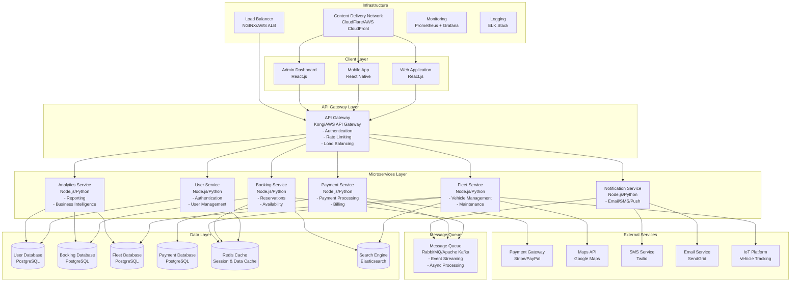

# Car Rental System - Technical Architecture

## 1. Architecture Overview

### 1.1 System Architecture Pattern
The car rental system follows a **microservices architecture** with **event-driven design** to ensure scalability, maintainability, and fault tolerance.

### 1.2 High-Level Architecture

## 2. Microservices Architecture

### 2.1 Service Decomposition

#### 2.1.1 User Service
**Responsibilities:**
- User authentication and authorization
- User profile management
- Role-based access control
- Session management

**Technology Stack:**
- Runtime: Node.js with Express.js or Python with FastAPI
- Database: PostgreSQL
- Cache: Redis
- Authentication: JWT with OAuth 2.0

#### 2.1.2 Booking Service
**Responsibilities:**
- Reservation management
- Availability checking
- Pricing calculations
- Booking modifications and cancellations

**Technology Stack:**
- Runtime: Node.js with Express.js
- Database: PostgreSQL
- Cache: Redis
- Search: Elasticsearch

#### 2.1.3 Fleet Service
**Responsibilities:**
- Vehicle inventory management
- Maintenance scheduling
- Location tracking
- Performance monitoring

**Technology Stack:**
- Runtime: Node.js with Express.js
- Database: PostgreSQL
- Cache: Redis
- IoT Integration: MQTT/WebSocket

#### 2.1.4 Payment Service
**Responsibilities:**
- Payment processing
- Billing and invoicing
- Refund management
- Financial reporting

**Technology Stack:**
- Runtime: Node.js with Express.js
- Database: PostgreSQL (encrypted)
- External APIs: Stripe, PayPal
- Compliance: PCI DSS

#### 2.1.5 Notification Service
**Responsibilities:**
- Email notifications
- SMS messaging
- Push notifications
- Communication templates

**Technology Stack:**
- Runtime: Node.js with Express.js
- External APIs: SendGrid, Twilio
- Queue: RabbitMQ
- Templates: Handlebars

#### 2.1.6 Analytics Service
**Responsibilities:**
- Business intelligence
- Reporting and dashboards
- Data aggregation
- Performance metrics

**Technology Stack:**
- Runtime: Python with FastAPI
- Database: PostgreSQL + ClickHouse
- Visualization: Grafana
- Processing: Apache Spark

### 2.2 Inter-Service Communication

#### 2.2.1 Synchronous Communication
- **HTTP/REST APIs**: For real-time operations
- **GraphQL**: For complex data fetching
- **gRPC**: For high-performance internal communication

#### 2.2.2 Asynchronous Communication
- **Event-Driven Architecture**: Using message queues
- **Event Sourcing**: For audit trails and state reconstruction
- **CQRS**: Command Query Responsibility Segregation

## 3. Data Architecture

### 3.1 Database Design Strategy

#### 3.1.1 Database per Service
Each microservice maintains its own database to ensure:
- Data isolation and independence
- Technology flexibility
- Scalability and performance
- Fault tolerance

#### 3.1.2 Data Consistency
- **Eventual Consistency**: For non-critical data
- **Saga Pattern**: For distributed transactions
- **Event Sourcing**: For audit and replay capabilities

### 3.2 Data Storage Technologies

#### 3.2.1 Primary Databases
- **PostgreSQL**: For transactional data (users, bookings, payments)
- **MongoDB**: For document-based data (vehicle specifications, configurations)
- **Redis**: For caching and session storage
- **Elasticsearch**: For search and analytics

#### 3.2.2 Data Warehouse
- **ClickHouse**: For analytical queries and reporting
- **Apache Kafka**: For real-time data streaming
- **Apache Spark**: For batch processing and ETL

## 4. Security Architecture

### 4.1 Security Layers

#### 4.1.1 Network Security
- **API Gateway**: Centralized authentication and authorization
- **WAF**: Web Application Firewall for DDoS protection
- **VPN**: Secure communication channels
- **SSL/TLS**: End-to-end encryption

#### 4.1.2 Application Security
- **OAuth 2.0**: Industry-standard authentication
- **JWT**: Stateless token-based authentication
- **RBAC**: Role-based access control
- **Input Validation**: Comprehensive data sanitization

#### 4.1.3 Data Security
- **Encryption at Rest**: Database encryption
- **Encryption in Transit**: TLS for all communications
- **PCI DSS Compliance**: For payment data
- **GDPR Compliance**: For personal data protection

### 4.2 Security Monitoring
- **SIEM**: Security Information and Event Management
- **Intrusion Detection**: Real-time threat monitoring
- **Vulnerability Scanning**: Regular security assessments
- **Penetration Testing**: Quarterly security audits

## 5. Scalability and Performance

### 5.1 Horizontal Scaling
- **Container Orchestration**: Kubernetes for service scaling
- **Auto-scaling**: Based on CPU, memory, and request metrics
- **Load Balancing**: Distributed traffic across service instances
- **Database Sharding**: Horizontal database partitioning

### 5.2 Performance Optimization
- **Caching Strategy**: Multi-level caching (Redis, CDN, Application)
- **Database Optimization**: Indexing, query optimization, connection pooling
- **CDN**: Content delivery for static assets
- **Compression**: Gzip compression for API responses

### 5.3 Monitoring and Observability
- **Application Monitoring**: Prometheus + Grafana
- **Log Aggregation**: ELK Stack (Elasticsearch, Logstash, Kibana)
- **Distributed Tracing**: Jaeger or Zipkin
- **Health Checks**: Service health monitoring and alerting

## 6. Deployment Architecture

### 6.1 Cloud Infrastructure
- **Cloud Provider**: AWS, Azure, or Google Cloud Platform
- **Container Platform**: Docker with Kubernetes
- **Infrastructure as Code**: Terraform or CloudFormation
- **CI/CD Pipeline**: GitHub Actions or GitLab CI

### 6.2 Environment Strategy
- **Development**: Local development with Docker Compose
- **Staging**: Production-like environment for testing
- **Production**: High-availability, multi-region deployment
- **Disaster Recovery**: Backup and recovery procedures

### 6.3 DevOps Practices
- **Blue-Green Deployment**: Zero-downtime deployments
- **Canary Releases**: Gradual rollout of new features
- **Feature Flags**: Toggle features without code deployment
- **Automated Testing**: Unit, integration, and end-to-end tests

## 7. Technology Stack Summary

### 7.1 Frontend
- **Web**: React.js with TypeScript, Material-UI
- **Mobile**: React Native with TypeScript
- **State Management**: Redux Toolkit
- **Build Tools**: Webpack, Metro (React Native)

### 7.2 Backend
- **Runtime**: Node.js with Express.js, Python with FastAPI
- **API Gateway**: Kong or AWS API Gateway
- **Message Queue**: RabbitMQ or Apache Kafka
- **Authentication**: JWT with OAuth 2.0

### 7.3 Data Layer
- **Primary Database**: PostgreSQL
- **Cache**: Redis
- **Search**: Elasticsearch
- **Analytics**: ClickHouse

### 7.4 Infrastructure
- **Cloud**: AWS/Azure/GCP
- **Containers**: Docker with Kubernetes
- **Monitoring**: Prometheus + Grafana
- **Logging**: ELK Stack

### 7.5 External Services
- **Payment**: Stripe, PayPal
- **Maps**: Google Maps API
- **Communication**: Twilio, SendGrid
- **Analytics**: Google Analytics, Mixpanel

## 8. Quality Assurance

### 8.1 Testing Strategy
- **Unit Testing**: Jest, Mocha for backend services
- **Integration Testing**: API testing with Postman/Newman
- **End-to-End Testing**: Cypress or Playwright
- **Performance Testing**: Load testing with JMeter or K6

### 8.2 Code Quality
- **Static Analysis**: ESLint, SonarQube
- **Code Coverage**: Minimum 80% coverage requirement
- **Code Review**: Mandatory peer review process
- **Documentation**: API documentation with Swagger/OpenAPI

---

*Document Version: 1.0*  
*Last Updated: [Current Date]*  
*Next Review: [Date + 3 months]*
